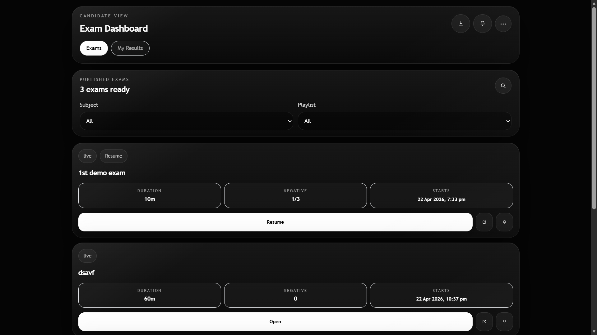
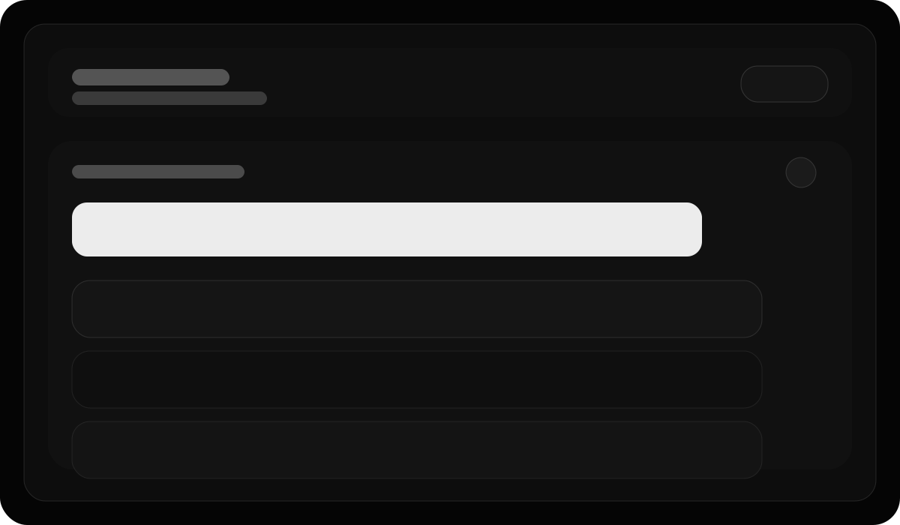
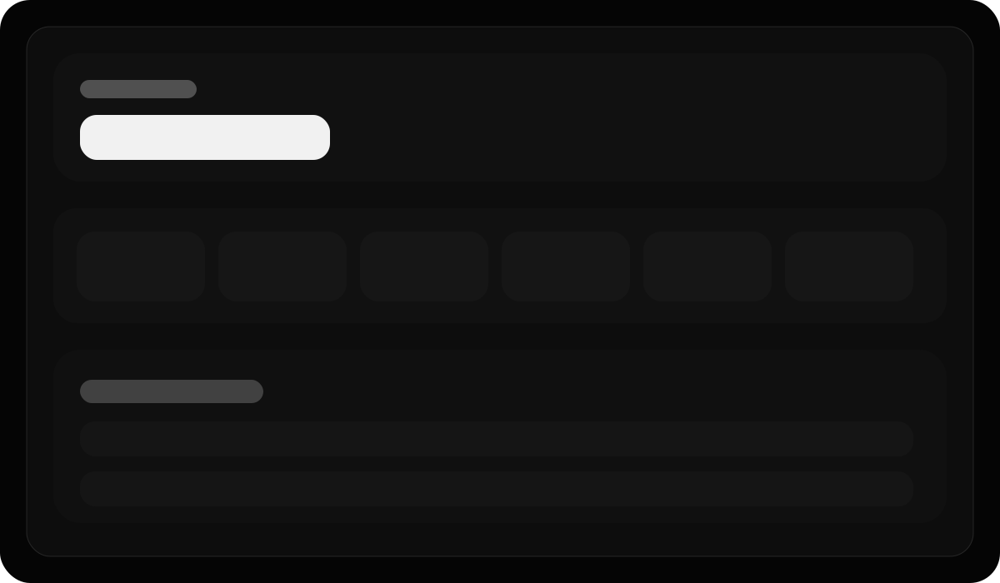

# Exam Platform

Modern full stack exam platform for competitive-test style practice, scheduling, secure attempts, and result analysis.



## Highlights

- Admin exam builder with create, edit, schedule, lock, import, and result review
- User exam flow with timer, autosave, fullscreen enforcement, review marking, and skip-without-penalty option
- Mobile-first dashboard and attempt screens
- PWA-ready install flow, browser reminders, offline-safe autosave queue, and exam sharing
- Detailed result analyzer with score, timing, skips, and attempt behavior

## Showcase

### Candidate Attempt


### Result Experience


## Tech Stack

### Frontend
- React + Vite
- Tailwind CSS
- React Router
- Context API
- Axios

### Backend
- Node.js
- Express
- MongoDB
- Mongoose
- JWT
- bcrypt

## Core Features

### Admin
- Create and update exams
- Set duration, marks, negative marking, attempts, lock state, and schedule
- Import questions from paste, `.txt`, and `.docx`
- View candidate results and analytics

### User
- Register and login with email/password
- Browse published exams by subject and playlist
- Share a specific exam link
- Set browser reminder for upcoming exams
- Resume active attempts
- Attempt exam in fullscreen-secured flow
- See clean result summary and detailed review

### Attempt Engine
- Question autosave
- Offline-safe answer queue and sync
- Tab-switch and fullscreen-exit tracking
- Auto submit on timer end
- No-penalty skip option

## Project Structure

```text
client/
  public/
  src/
server/
  src/
docs/
```

## Local Setup

### 1. Install

```bash
npm install
```

### 2. Environment

Create these files:

- `server/.env`
- `client/.env`

Example server env:

```env
PORT=5000
MONGO_URI=mongodb://127.0.0.1:27017/exam-platform
JWT_SECRET=your_jwt_secret
CLIENT_URL=http://localhost:5173
```

Example client env:

```env
VITE_API_BASE_URL=http://localhost:5000/api
```

### 3. Run

```bash
npm run dev
```

### 4. Build

```bash
npm run build
```

## Default URLs

- Frontend: `http://localhost:5173`
- Backend: `http://localhost:5000`
- Health check: `http://localhost:5000/api/health`

## Deployment

### Recommended
- Frontend: Vercel
- Backend: Render
- Database: MongoDB Atlas

### Required Production Environment Variables

Server:

```env
MONGO_URI=
JWT_SECRET=
CLIENT_URL=
PORT=
```

Client:

```env
VITE_API_BASE_URL=
```

## Performance Notes

- Lightweight admin exam listing for large question sets
- Client-side parsing for pasted and `.txt` imports
- Code-split frontend routes
- Manual vendor chunking in Vite
- Offline autosave queue for network drops
- Reduced noisy health-check logging on server

## Roadmap Ideas

- True push notifications with backend subscription service
- Rank / leaderboard
- Math rendering
- Question bank and random paper generation
- Bookmarks-only retry mode
- Exportable result PDF

## License

Personal / project use. Update as needed for your preferred license.
